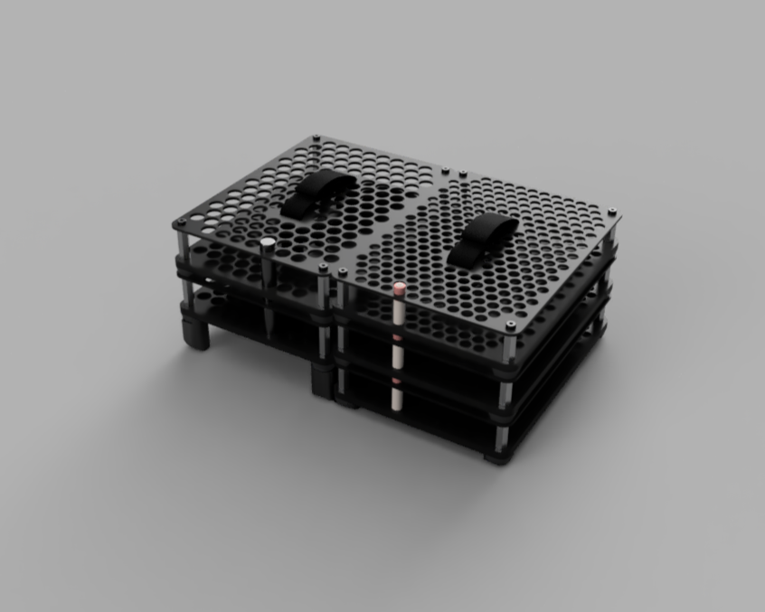
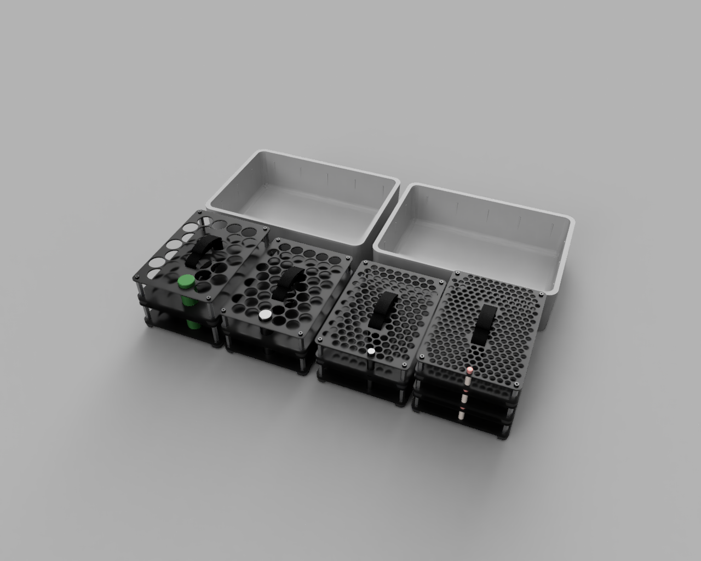
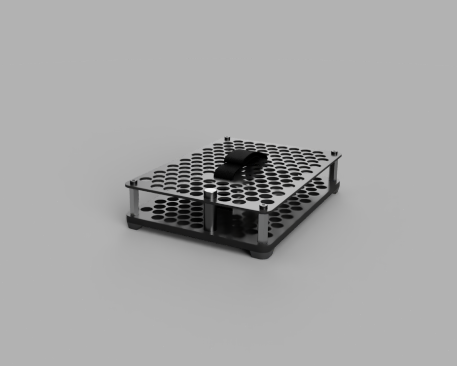
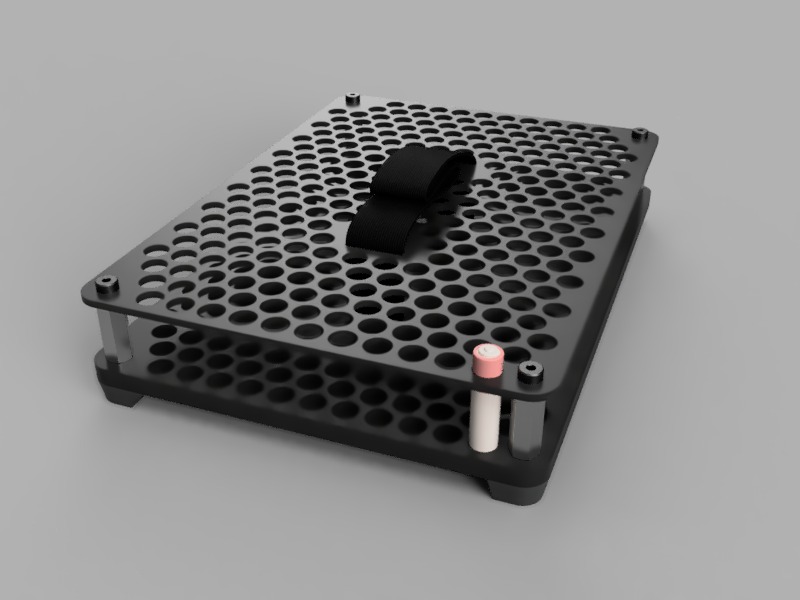

# Battery Box #
This battery box is designed to contain lots and lots of AA and AAA battieries inside a pelican 1450 case. It holds three trays holding 50 AAA batteries each and two trays holding 50 AA batteries each. The plates are printed in ABS and assembled using M5 hardware.

The trays are designed to keep the batteries contained by the tray above and the lid of the pelican case.

## Assembly ##

## Trays in 2 Pelicans ##

## AA tray ##

## AAA tray ##
